# STREAMFLIX

## Shared VPC on Google Cloud Console - Step-by-Step Demo Guide

Build the 3-tier StreamFlix demo (web, app, data) across **1 host project + 3 service projects** using only the Google Cloud Console (no gcloud).

| **Item**              | **Value**                                                                               |
|-----------------------|-----------------------------------------------------------------------------------------|
| Region / Zone         | asia-south1 (Mumbai) / asia-south1-a                                                    |
| VPC                   | streamflix-shared-vpc (custom mode)                                                     |
| Subnets               | web 10.10.1.0/24, app 10.10.2.0/24, data 10.10.3.0/24                                   |
| VMs                   | sf-web 10.10.1.10, sf-app 10.10.2.10, sf-db 10.10.3.10                                  |
| Project IDs (example) | streamflix-network-nr01, streamflix-web-nr01, streamflix-app-nr01, streamflix-data-nr01 |
| Note                  | Project IDs are global. Replace "nr01" with your own unique suffix everywhere.          |

**How to use the screenshot boxes:** each step has a dashed box. Take the screenshot described in it (Windows: Win+Shift+S, Mac: Cmd+Shift+4), paste it into the box, then delete the box text. Console labels can shift slightly between releases; follow the field names and values.

**Traffic flow:** Internet -> sf-web:80 -> sf-app:5000 -> sf-db:5432. Each hop is allowed only from the previous subnet.

## Step 0 - Prerequisites

1. Open https://console.cloud.google.com and sign in.

2. Click the **project picker** (top bar) and confirm your **Organization** appears. Shared VPC does not work without an Organization.

3. In the picker select the **Organization**, then go to **IAM & Admin > IAM > Grant access**.

4. Add your own email with roles: **Project Creator**, **Billing Account User**, **Shared VPC Admin**. Click **Save**.

5. Have a billing account ready (Navigation menu > Billing).

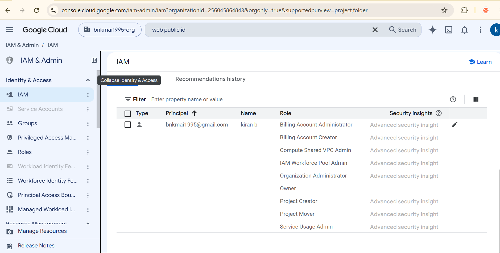

**Expected:** Your user has the 3 roles at organization level.

## Step 1 - Create the 4 projects

**Working in project: Project picker > New project**

1. Click the project picker (top bar) > **New project**.

2. Enter **Project name** and click **Edit** to set the **Project ID** as in the table.

3. Under **Location** choose your Organization. Click **Create**.

4. Repeat until all 4 projects exist.

| **Role**            | **Project ID**          |
|---------------------|-------------------------|
| Host (owns network) | streamflix-network-nr01 |
| Service - web       | streamflix-web-nr01     |
| Service - app       | streamflix-app-nr01     |
| Service - data      | streamflix-data-nr01    |

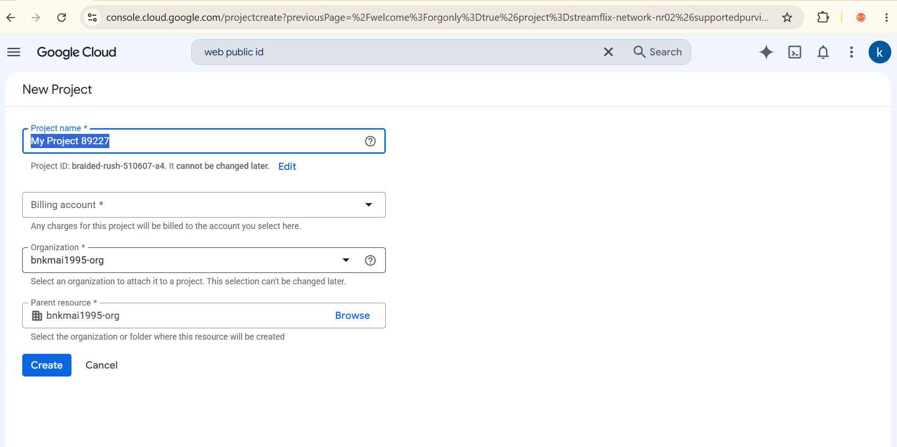

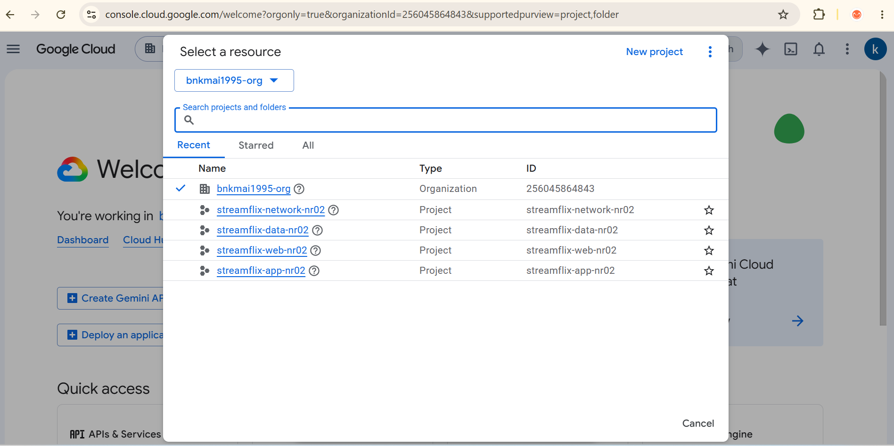

**Expected:** 4 projects created under the organization.

## Step 2 - Link billing to each project

**Working in project: Navigation menu > Billing**

1. Open **Billing**, select your billing account.

2. Go to **Account management** (or **My projects**).

3. For each of the 4 projects: **Actions (three dots) > Change billing > select your account > Set account**.

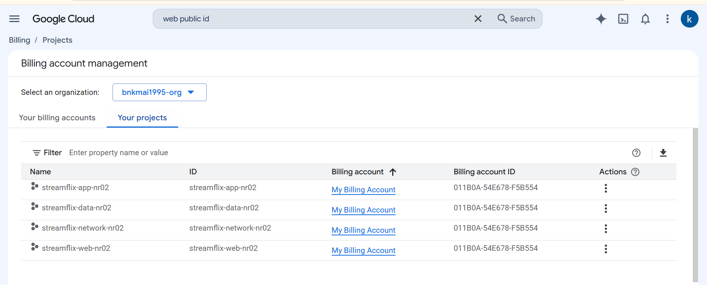

**Expected:** All 4 projects show your billing account.

## Step 3 - Enable the Compute Engine API (4 times)

**Working in project: Repeat in each of the 4 projects**

1. Select the project in the picker.

2. Navigation menu > **APIs & Services > Library**.

3. Search **Compute Engine API** > open it > **Enable** (takes ~1 minute).

4. Repeat for the other 3 projects.

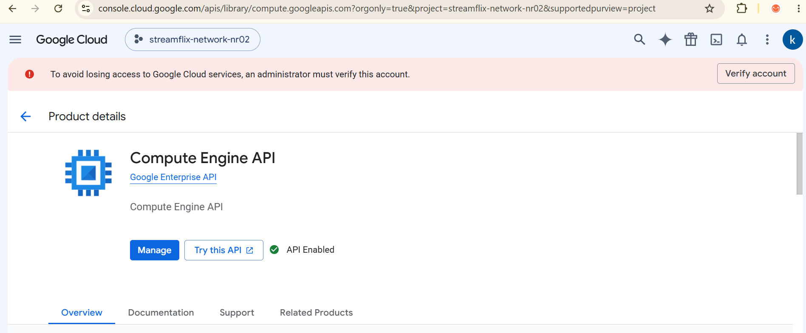

**Expected:** Compute Engine API enabled in host and all service projects.

## Step 4 - Create the VPC and 3 subnets

**Working in project: Project: streamflix-network-nr01**

1. Switch to the **host project**.

2. Navigation menu > **VPC network > VPC networks > Create VPC network**.

3. Name: **streamflix-shared-vpc**. Subnet creation mode: **Custom**.

4. Under **New subnet** enter the first subnet from the table, click **Done**, then **Add subnet** for the other two. Keep Private Google Access **Off**, Flow logs **Off**.

5. Leave Firewall rules untouched (we add our own in Step 9). Dynamic routing mode: **Regional**. Click **Create**.

| **Subnet name** | **Region**  | **IPv4 range** |
|-----------------|-------------|----------------|
| web-subnet      | asia-south1 | 10.10.1.0/24   |
| app-subnet      | asia-south1 | 10.10.2.0/24   |
| data-subnet     | asia-south1 | 10.10.3.0/24   |

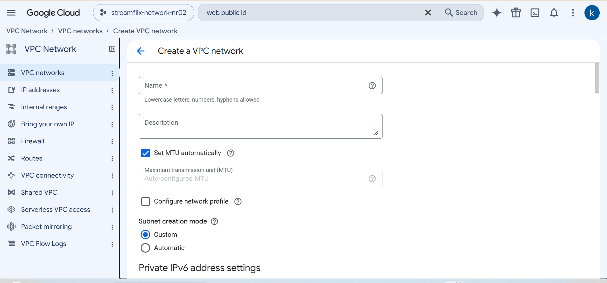

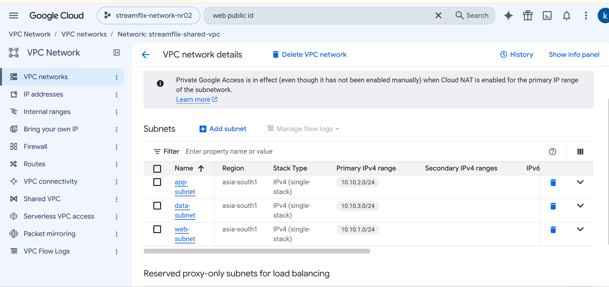

**Expected:** VPC streamflix-shared-vpc with 3 subnets in asia-south1.

## Step 5 - Enable the host project

**Working in project: Project: streamflix-network-nr01**

1. Navigation menu > **VPC network > Shared VPC**.

2. Click **Set up Shared VPC**.

3. On "Enable host project" click **Save and continue**.

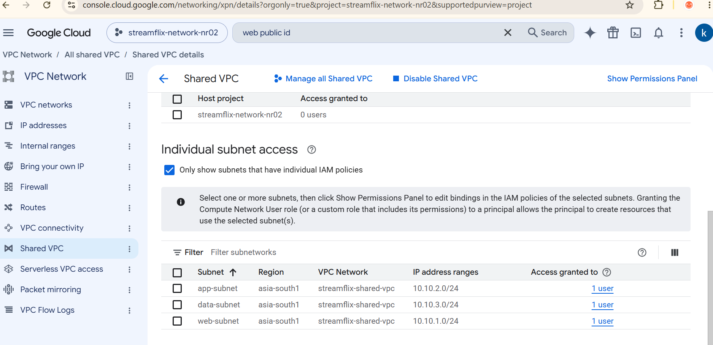

**Expected:** The wizard moves to the "Select subnets" screen.

## Step 6 - Share subnets and attach service projects

**Working in project: Project: streamflix-network-nr01**

1. Sharing mode: choose **Individual subnets (subnet-level permissions)**.

2. Under **Subnets to share** select **web-subnet, app-subnet, data-subnet**. Click **Continue**.

3. On "Give permissions": under **Select projects to attach** click **Attach projects** and tick the 3 service projects.

4. Under **Select users by role** (Compute Network User) add your user email (in real life, a team group). Click **Save**.

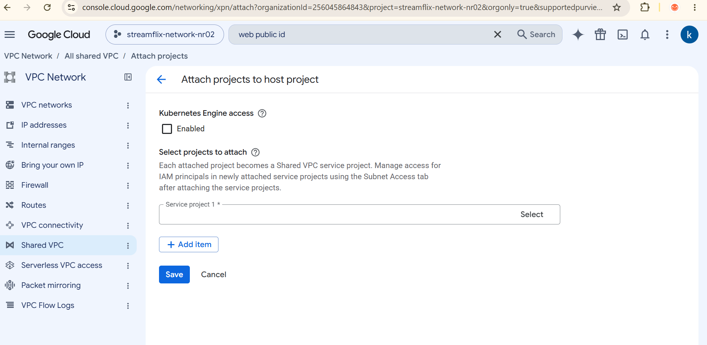

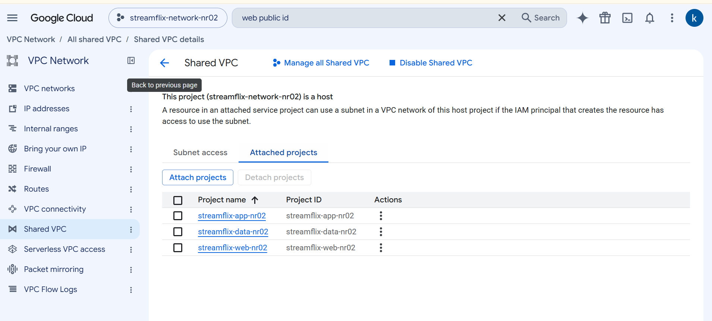

**Expected:** Shared VPC page > \*\*Attached projects\*\* tab lists the 3 service projects.

## Step 7 - Give yourself VM rights in the service projects

**Working in project: Repeat in WEB, APP and DATA projects**

1. Select a service project in the picker.

2. **IAM & Admin > IAM > Grant access**.

3. Principal: your email. Role: **Compute Instance Admin (v1)**. Save.

4. Repeat for the other 2 service projects. (Skip if you are already Owner of these projects.)

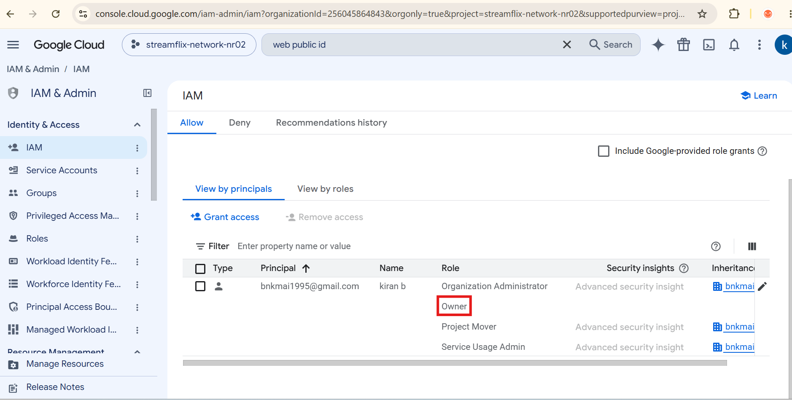

**Expected:** You can create VMs in all 3 service projects.

## Step 8 - Create the 4 firewall rules

**Working in project: Project: streamflix-network-nr01**

1. Switch to the **host project**. **VPC network > Firewall > Create firewall rule**.

2. Common fields for all 4 rules: Network **streamflix-shared-vpc**, Priority **1000**, Direction **Ingress**, Action **Allow**, Targets **Specified target tags**, Source filter **IPv4 ranges**.

3. Use the table for the name, target tags, source range and protocol. Choose **Specified protocols and ports > TCP** and enter the port. Click **Create**.

4. Repeat for each rule.

| **Name**     | **Target tags** | **Source IPv4 range** | **TCP port** |
|--------------|-----------------|-----------------------|--------------|
| sf-allow-web | web             | 0.0.0.0/0             | 80           |
| sf-allow-app | app             | 10.10.1.0/24          | 5000         |
| sf-allow-db  | db              | 10.10.2.0/24          | 5432         |
| sf-allow-iap | web,app,db      | 35.235.240.0/20       | 22           |

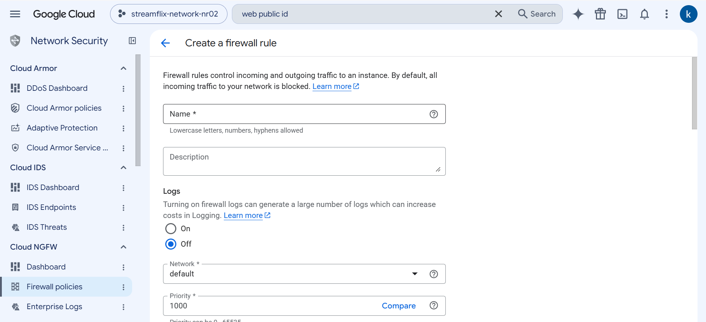

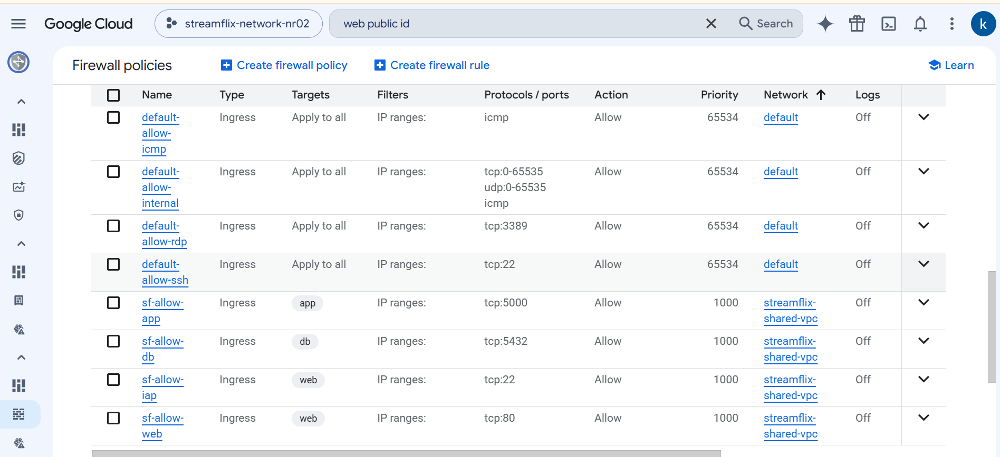

**Expected:** 4 rules visible in the Firewall list.

## Step 9 - Create Cloud NAT

**Working in project: Project: streamflix-network-nr01**

1. Navigation menu > **Network services > Cloud NAT > Create Cloud NAT gateway**.

2. Gateway name **sf-nat**, NAT type **Public**, Network **streamflix-shared-vpc**, Region **asia-south1**.

3. Cloud Router: **Create new router**, name **sf-router**, click **Create**.

4. NAT mapping Source: **All subnet IP ranges** (default). Click **Create**.

5. Why: app and db VMs have no public IP but need internet once to install packages.

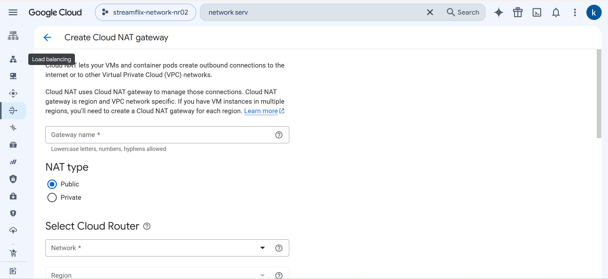

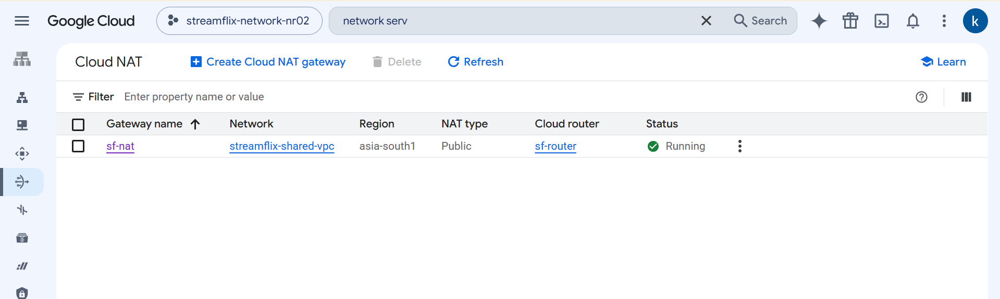

**Expected:** sf-nat created in asia-south1.

## Step 10 - Create the database VM (Tier 3)

**Working in project: Project: streamflix-data-nr01**

1. Switch to project **streamflix-data-nr01**. **Compute Engine > VM instances > Create instance**.

2. Name **sf-db**, Region **asia-south1**, Zone **asia-south1-a**, Machine type **e2-small** (E2 series).

3. Left menu **OS and storage > Change**: Operating system **Debian**, Version **Debian GNU/Linux 12 (bookworm)**, Select.

4. Left menu **Networking**: in **Network tags** type **db** and press Enter.

5. Under **Network interfaces** click the default interface to edit. Choose **Networks shared with me (from host project: streamflix-network-nr01)** and select subnet **data-subnet**.

6. **Primary internal IPv4 address**: choose **Ephemeral (Custom)** and enter **10.10.3.10**.

7. **External IPv4 address**: **None** (private VM). Click **Done**.

8. Open **Advanced > Management**. In **Automation > Startup script** paste the full text of **scripts/db-startup.sh** (Appendix B1).

9. Under **Metadata > Add item**: Key **init-sql**, Value = full text of **database/init.sql** (Appendix B2).

10. Click **Create**.

| **Field**    | **Value**                      |
|--------------|--------------------------------|
| Subnet       | data-subnet (shared from host) |
| Internal IP  | 10.10.3.10                     |
| External IP  | None                           |
| Network tag  | db                             |
| Metadata key | init-sql                       |

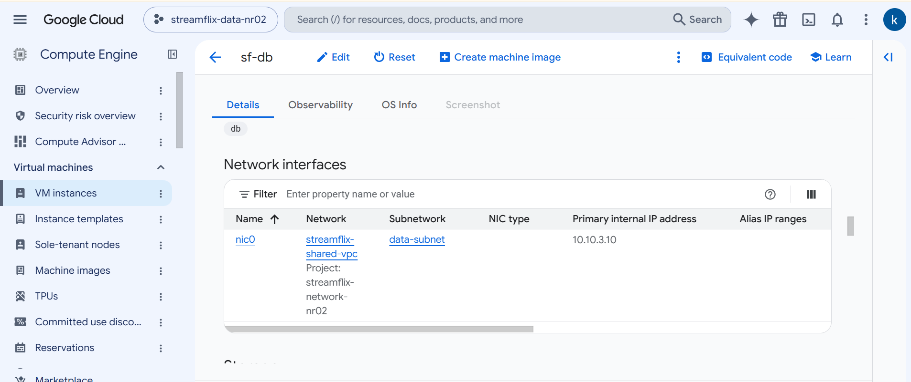

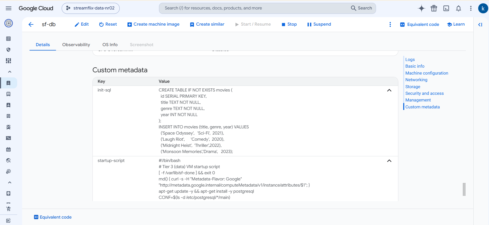

**Expected:** sf-db running with internal IP 10.10.3.10 (no external IP).

## Step 11 - Create the backend VM (Tier 2)

**Working in project: Project: streamflix-app-nr01**

1. Switch to project **streamflix-app-nr01**. **Compute Engine > VM instances > Create instance**.

2. Name **sf-app**, Region **asia-south1**, Zone **asia-south1-a**, Machine type **e2-small** (E2 series).

3. Left menu **OS and storage > Change**: Operating system **Debian**, Version **Debian GNU/Linux 12 (bookworm)**, Select.

4. Left menu **Networking**: in **Network tags** type **app** and press Enter.

5. Under **Network interfaces** click the default interface to edit. Choose **Networks shared with me (from host project: streamflix-network-nr01)** and select subnet **app-subnet**.

6. **Primary internal IPv4 address**: choose **Ephemeral (Custom)** and enter **10.10.2.10**.

7. **External IPv4 address**: **None** (private VM). Click **Done**.

8. Open **Advanced > Management**. In **Startup script** paste **scripts/app-startup.sh** (Appendix B3).

9. Under **Metadata > Add item**: Key **app-py**, Value = full text of **backend/app.py** (Appendix B4).

10. Click **Create**.

| **Field**    | **Value**                     |
|--------------|-------------------------------|
| Subnet       | app-subnet (shared from host) |
| Internal IP  | 10.10.2.10                    |
| External IP  | None                          |
| Network tag  | app                           |
| Metadata key | app-py                        |

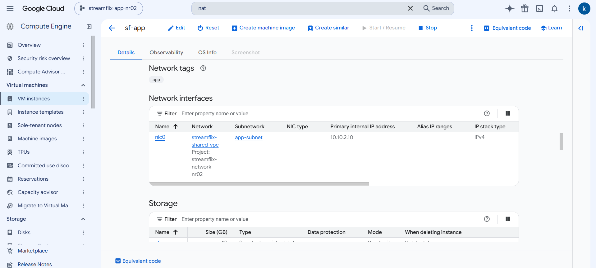

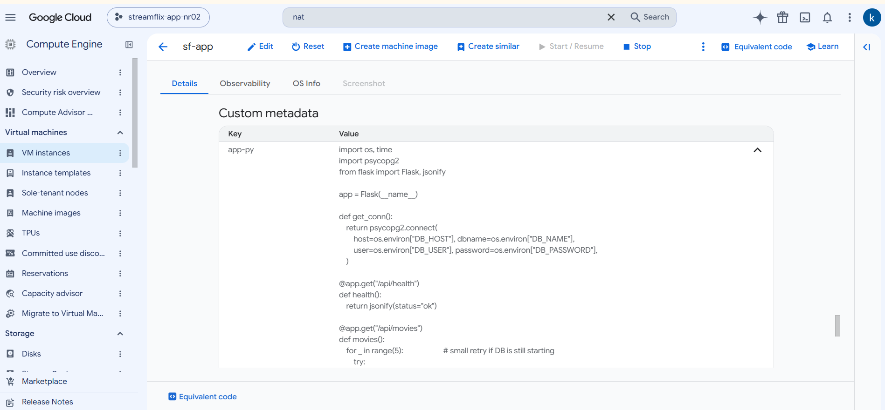

**Expected:** sf-app running with internal IP 10.10.2.10.

## 

## Step 12 - Create the frontend VM (Tier 1)

**Working in project: Project: streamflix-web-nr01**

1. Switch to project **streamflix-web-nr01**. **Compute Engine > VM instances > Create instance**.

2. Name **sf-web**, Region **asia-south1**, Zone **asia-south1-a**, Machine type **e2-small** (E2 series).

3. Left menu **OS and storage > Change**: Operating system **Debian**, Version **Debian GNU/Linux 12 (bookworm)**, Select.

4. Left menu **Networking**: in **Network tags** type **web** and press Enter.

5. Under **Network interfaces** click the default interface to edit. Choose **Networks shared with me (from host project: streamflix-network-nr01)** and select subnet **web-subnet**.

6. **Primary internal IPv4 address**: choose **Ephemeral (Custom)** and enter **10.10.1.10**.

7. **External IPv4 address**: **Ephemeral** (public IP). Click **Done**.

8. Do NOT tick "Allow HTTP traffic" (our firewall rule in the host project handles it).

9. Open **Advanced > Management**. In **Startup script** paste **scripts/web-startup.sh** (Appendix B5).

10. Under **Metadata > Add item** add two items: **index-html** = full text of **frontend/index.html** (B6) and **nginx-conf** = full text of **frontend/nginx.conf** (B7).

11. Click **Create**. Wait about 3 minutes for all three startup scripts to finish.

| **Field**     | **Value**                     |
|---------------|-------------------------------|
| Subnet        | web-subnet (shared from host) |
| Internal IP   | 10.10.1.10                    |
| External IP   | Ephemeral                     |
| Network tag   | web                           |
| Metadata keys | index-html, nginx-conf        |

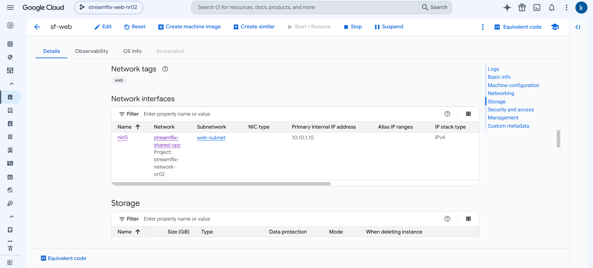

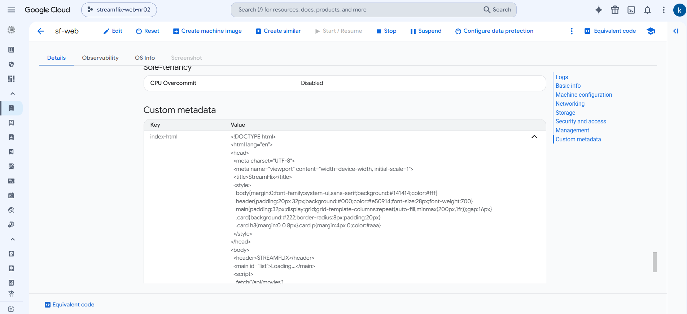

**Expected:** sf-web running with internal 10.10.1.10 and a public IP.

## Step 13 - Verify the Shared VPC behaviour

**Working in project: Check all 4 projects**

1. In each service project open **VM instances**: note the **Internal IP** is 10.10.x.x although the VM is in a different project from the network.

2. Switch to the **host project > VPC network > VPC networks > streamflix-shared-vpc** and open a subnet: it shows the shared status and attached projects.

3. Host project > **VPC network > IP addresses**: the internal IPs of the 3 VMs are listed here too.

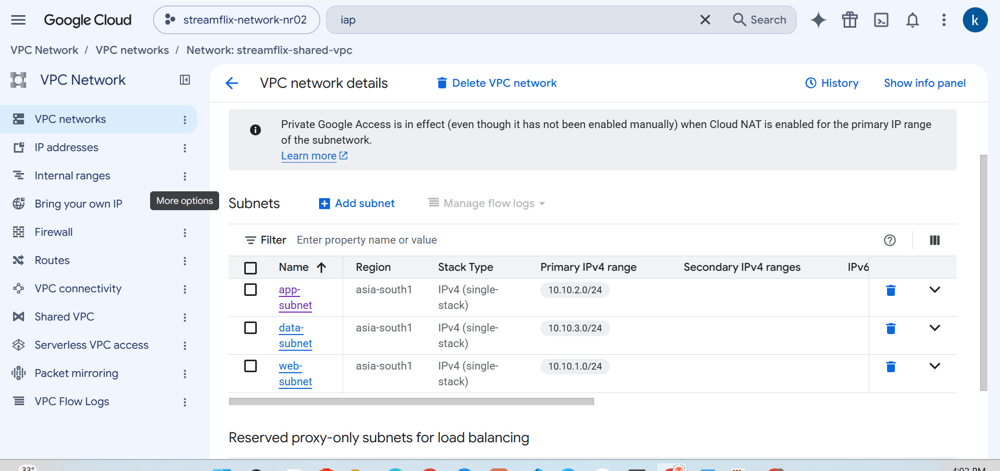

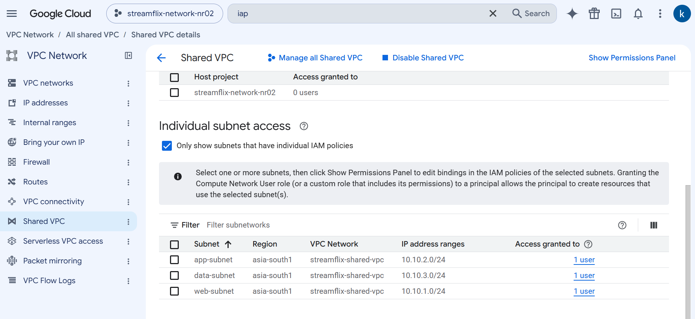

**Expected:** Three VMs in three projects, all using IPs from the host project subnets.

## Step 14 - Test the application

**Working in project: Web project**

1. In **VM instances** (web project) copy the **External IP** of sf-web.

2. In your browser open **http://EXTERNAL_IP** (use http, not https). The StreamFlix page with 4 movie cards should appear.

3. Open **http://EXTERNAL_IP/api/health** - should show {"status":"ok"} (web to app).

4. Open **http://EXTERNAL_IP/api/movies** - JSON with 4 movies (web to app to db).

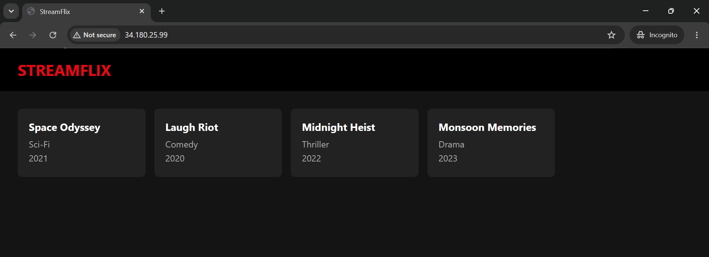

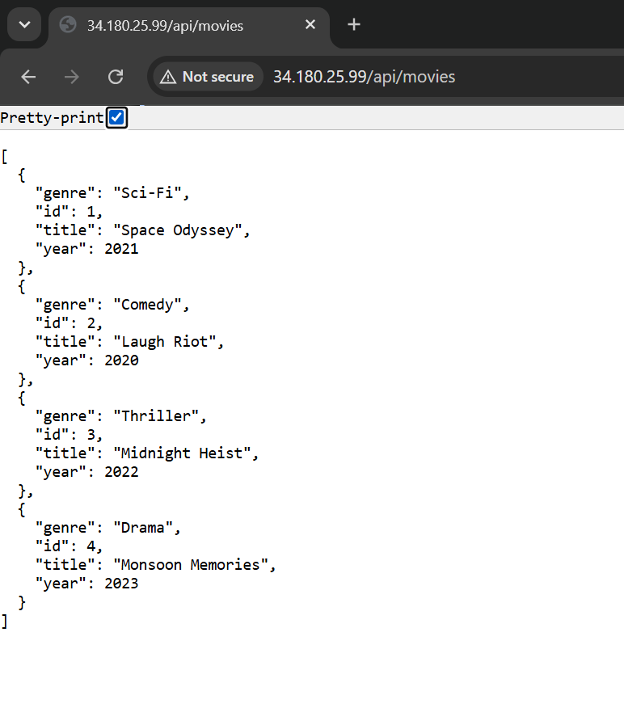

**Expected:** Full web -> app -> db chain works across 3 projects.

## Step 15 - Prove tier isolation (optional)

**Working in project: App and web projects**

1. App project > VM instances > sf-app > **SSH** button (opens browser SSH through IAP).

2. Run: **timeout 5 bash -c "</dev/tcp/10.10.3.10/5432" && echo OPEN \|\| echo BLOCKED** -> expect **OPEN** (app is allowed to reach db).

3. Web project > sf-web > **SSH**, run the same command -> expect **BLOCKED** (web may not reach db).

4. If SSH to sf-web times out, edit rule sf-allow-iap and temporarily add your public IP as /32 in the source ranges.

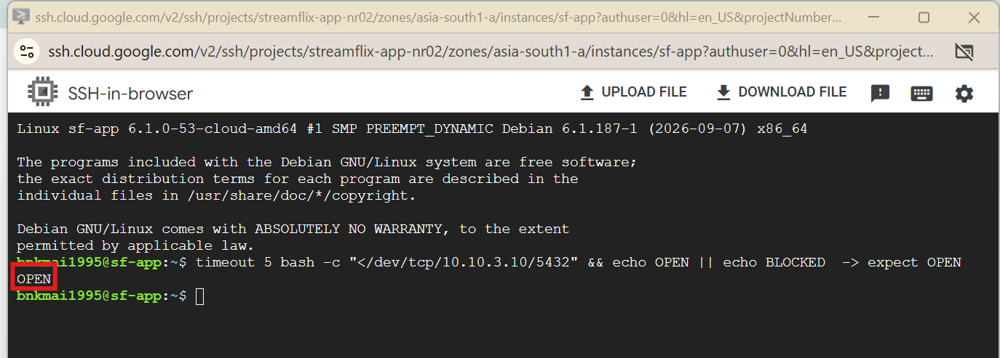

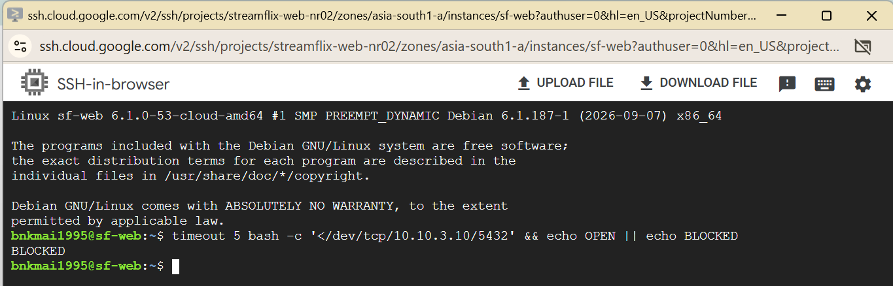

**Expected:** OPEN from the app VM, BLOCKED from the web VM.

## Step 16 - Cleanup (avoid charges)

**Working in project: Order matters**

1. Delete VMs: in each service project **VM instances > select VM > Delete**.

2. Host project: **Network services > Cloud NAT** > delete sf-nat. Then **Cloud Routers** > delete sf-router.

3. Host project: **VPC network > Firewall** > delete the 4 sf-allow-\* rules.

4. Host project: **Shared VPC > Attached projects** > select all > **Detach**. Then **Disable Shared VPC**.

5. **VPC networks** > open streamflix-shared-vpc > **Delete VPC network** (deletes subnets).

6. For each of the 4 projects: **IAM & Admin > Settings > Shut down**, type the Project ID to confirm.

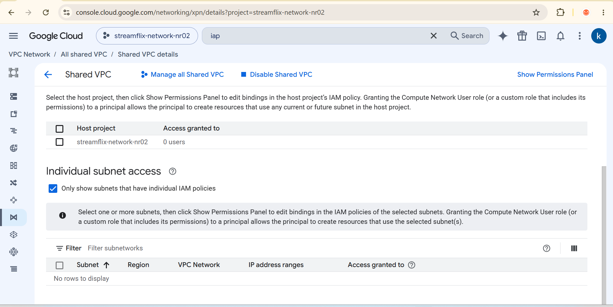

**Expected:** No billable resources remain.

# Appendix A - Troubleshooting

| **Symptom**                                | **Fix**                                                                                                           |
|--------------------------------------------|-------------------------------------------------------------------------------------------------------------------|
| Shared VPC menu missing / cannot enable    | Project not under an Organization, or missing Shared VPC Admin role (Step 0).                                     |
| Shared subnets not listed when creating VM | Subnet not shared, or you lack Compute Network User on it (Step 6). Check you chose "Networks shared with me".    |
| Cannot select external IP                  | Org policy compute.vmExternalIpAccess blocks it; ask admin to allow for sf-web.                                   |
| Page not loading                           | Wait 3 min; use http://; check sf-allow-web tag "web" matches the VM tag.                                         |
| /api/movies shows 503                      | DB not ready. Open sf-db > Logs / Serial port 1 and check the startup script finished; confirm rule sf-allow-db. |
| Startup script did not run                 | VM > Logs > Serial port 1 (console). Fix script, then Stop/Start VM after deleting /var/lib/sf-done.            |

## Appendix B - Files to paste into the VM metadata

Copy each block exactly.

### B1. scripts/db-startup.sh (sf-db startup script)

```bash
#!/bin/bash
# Tier 3 (data) VM startup script
[ -f /var/lib/sf-done ] && exit 0
md() { curl -s -H "Metadata-Flavor: Google" "http://metadata.google.internal/computeMetadata/v1/instance/attributes/$1"; }
apt-get update -y && apt-get install -y postgresql
CONF=$(ls -d /etc/postgresql/*/main)
echo "listen_addresses='*'" >> $CONF/postgresql.conf
echo "host streamflix streamflix 10.10.2.0/24 scram-sha-256" >> $CONF/pg_hba.conf   # only app-subnet
systemctl restart postgresql
sudo -u postgres psql -c "CREATE USER streamflix WITH PASSWORD 'streamflix123';"
sudo -u postgres createdb -O streamflix streamflix
md init-sql > /tmp/init.sql
PGPASSWORD=streamflix123 psql -h 127.0.0.1 -U streamflix -d streamflix -f /tmp/init.sql
touch /var/lib/sf-done
```

### B2. database/init.sql (sf-db metadata key init-sql)

```sql
CREATE TABLE IF NOT EXISTS movies (
  id SERIAL PRIMARY KEY,
  title TEXT NOT NULL,
  genre TEXT NOT NULL,
  year INT NOT NULL
);
INSERT INTO movies (title, genre, year) VALUES
  ('Space Odyssey',   'Sci-Fi',  2021),
  ('Laugh Riot',      'Comedy',  2020),
  ('Midnight Heist',  'Thriller',2022),
  ('Monsoon Memories','Drama',   2023);
```

### B3. scripts/app-startup.sh (sf-app startup script)

```bash
#!/bin/bash
# Tier 2 (app) VM startup script
[ -f /var/lib/sf-done ] && exit 0
md() { curl -s -H "Metadata-Flavor: Google" "http://metadata.google.internal/computeMetadata/v1/instance/attributes/$1"; }
apt-get update -y && apt-get install -y python3-flask python3-psycopg2
mkdir -p /opt/streamflix
md app-py > /opt/streamflix/app.py
cat > /etc/systemd/system/streamflix.service <<UNIT
[Unit]
Description=StreamFlix API
After=network.target
[Service]
Environment=DB_HOST=10.10.3.10 DB_NAME=streamflix DB_USER=streamflix DB_PASSWORD=streamflix123
ExecStart=/usr/bin/python3 /opt/streamflix/app.py
Restart=always
[Install]
WantedBy=multi-user.target
UNIT
systemctl daemon-reload
systemctl enable --now streamflix
touch /var/lib/sf-done
```

### B4. backend/app.py (sf-app metadata key app-py)

```python
import os, time
import psycopg2
from flask import Flask, jsonify

app = Flask(__name__)

def get_conn():
    return psycopg2.connect(
        host=os.environ["DB_HOST"], dbname=os.environ["DB_NAME"],
        user=os.environ["DB_USER"], password=os.environ["DB_PASSWORD"],
    )

@app.get("/api/health")
def health():
    return jsonify(status="ok")

@app.get("/api/movies")
def movies():
    for _ in range(5):                      # small retry if DB is still starting
        try:
            with get_conn() as conn, conn.cursor() as cur:
                cur.execute("SELECT id, title, genre, year FROM movies ORDER BY id")
                rows = cur.fetchall()
            return jsonify([dict(id=r[0], title=r[1], genre=r[2], year=r[3]) for r in rows])
        except psycopg2.OperationalError:
            time.sleep(2)
    return jsonify(error="database unavailable"), 503

if __name__ == "__main__":
    app.run(host="0.0.0.0", port=5000)
```

### B5. scripts/web-startup.sh (sf-web startup script)

```bash
#!/bin/bash
# Tier 1 (web) VM startup script
[ -f /var/lib/sf-done ] && exit 0
md() { curl -s -H "Metadata-Flavor: Google" "http://metadata.google.internal/computeMetadata/v1/instance/attributes/$1"; }
apt-get update -y && apt-get install -y nginx
md index-html > /var/www/html/index.html
md nginx-conf | sed -e 's#http://backend:5000#http://10.10.2.10:5000#' \
                    -e 's#/usr/share/nginx/html#/var/www/html#' > /etc/nginx/sites-available/default
systemctl restart nginx
touch /var/lib/sf-done
```

### B6. frontend/index.html (sf-web metadata key index-html)

```html
<!DOCTYPE html>
<html lang="en">
<head>
  <meta charset="UTF-8">
  <meta name="viewport" content="width=device-width, initial-scale=1">
  <title>StreamFlix</title>
  <style>
    body{margin:0;font-family:system-ui,sans-serif;background:#141414;color:#fff}
    header{padding:20px 32px;background:#000;color:#e50914;font-size:28px;font-weight:700}
    main{padding:32px;display:grid;grid-template-columns:repeat(auto-fill,minmax(200px,1fr));gap:16px}
    .card{background:#222;border-radius:8px;padding:20px}
    .card h3{margin:0 0 8px}.card p{margin:4px 0;color:#aaa}
  </style>
</head>
<body>
  <header>STREAMFLIX</header>
  <main id="list">Loading...</main>
  <script>
    fetch('/api/movies')
      .then(r => r.json())
      .then(movies => {
        document.getElementById('list').innerHTML = movies.map(m =>
          `<div class="card"><h3>${m.title}</h3><p>${m.genre}</p><p>${m.year}</p></div>`).join('');
      })
      .catch(() => document.getElementById('list').textContent = 'Could not load movies');
  </script>
</body>
</html>
```

### B7. frontend/nginx.conf (sf-web metadata key nginx-conf)

```nginx
server {
  listen 80;
  root /usr/share/nginx/html;
  index index.html;

  location /api/ {
    proxy_pass http://backend:5000/api/;
  }
}
```

